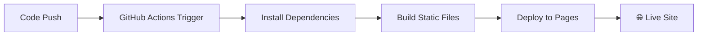

# RTEÜ Bilgisayar Mühendisliği Kariyer Yol Haritası

🎯 **Recep Tayyip Erdoğan Üniversitesi Bilgisayar Mühendisliği öğrencileri için kapsamlı ve interaktif kariyer rehberi**

[](https://github.com/coruhtech/mudek-kariyer-haritasi/actions/workflows/static.yml)
[](http://www.coruh.com.tr/)
[](https://nodejs.org/)

Bu proje, bilgisayar mühendisliği öğrencilerinin kariyer planlaması yapabilmeleri için geliştirilmiş modern ve kullanıcı dostu bir web uygulamasıdır. Platform, 2020 ve 2024 müfredatlarını analiz ederek öğrencilere kişiselleştirilmiş ders önerileri ve kariyer yönlendirmesi sunar.

**⚠️ Bu proje [CORUH R&D and TECHNOLOGY](http://www.coruh.com.tr/) şirketinin özel mülkiyetindedir ve açık kaynak değildir.**

## 🚀 Canlı Demo

Bu proje GitHub Pages'de yayınlanmaktadır:

**🌐 [Canlı Demo'yu Görüntüle](https://coruhtech.github.io/mudek-kariyer-haritasi/)**

> **Not**: Site https://coruhtech.github.io/mudek-kariyer-haritasi/ adresinde yayında.

## ✨ Özellikler

### 🚀 Kariyer Keşfi

- **6 Ana Kariyer Yolu**: Yazılım Geliştirme, Siber Güvenlik, Veri Bilimi, Web & Mobil Geliştirme, Yapay Zeka & Makine Öğrenimi, Sistem & Network Yönetimi
- **Detaylı İş Pozisyonları**: Her kariyer yolu için güncel pozisyon bilgileri
- **Beceri Haritası**: Gerekli teknik ve soft skill'ler
- **Sektör Analizi**: İş piyasası trendleri ve maaş bilgileri

### 📚 Akıllı Müfredat Sistemi

- **Çift Müfredat Desteği**: 2020 ve 2024 müfredatlarının karşılaştırmalı analizi
- **Dinamik Ders Eşleştirme**: JSON tabanlı detaylı ders bilgi sistemi (189+ ders)
- **Seçmeli Ders Optimizasyonu**: Kariyer hedeflerine uygun seçmeli ders önerileri
- **İlerleme Takibi**: Dönemlik ve yıllık ders planlaması

### 🎯 Kişiselleştirme

- **İlgi Alanı Testi**: Kapsamlı profil oluşturma
- **Akıllı Öneri Sistemi**: AI destekli kariyer ve ders tavsiyeleri
- **Sertifika Rehberi**: Her alan için güncel ve geçerli sertifikalar
- **Kaynak Önerileri**: Kitap, kurs ve eğitim materyalleri

### 💻 Modern Teknoloji Altyapısı

- **Responsive Design**: Tüm cihazlarda optimal deneyim
- **Progressive Web App**: Offline çalışma desteği
- **GitHub Pages**: Otomatik deployment ve hosting
- **SEO Optimized**: Arama motoru dostu yapı

## 🚀 GitHub Pages'e Otomatik Deployment

Bu proje GitHub Actions kullanılarak **her commit'te otomatik olarak** GitHub Pages'e deploy edilir.

### 🔧 Kurulum (Tek Seferlik)

1. **Repository Fork/Clone Edin**
   
   ```bash
   git clone https://github.com/coruhtech/mudek-kariyer-haritasi.git
   cd mudek-kariyer-haritasi
   ```

2. **Repository Settings → Pages**
   
   - GitHub repository'nizde `Settings` → `Pages` bölümüne gidin
   - **Source**: `GitHub Actions` seçin
   - **Custom domain** (opsiyonel): Kendi domain'inizi ekleyebilirsiniz

3. **Repository URL'lerini Güncelleyin**
   
   `package.json` dosyasında aşağıdaki alanları güncelleyin:
   
   ```json
   {
     "homepage": "https://coruhtech.github.io/mudek-kariyer-haritasi",
     "repository": {
       "type": "git", 
       "url": "https://github.com/coruhtech/mudek-kariyer-haritasi.git"
     },
     "bugs": {
       "url": "https://github.com/coruhtech/mudek-kariyer-haritasi/issues"
     }
   }
   ```

4. **README.md'de Badge URL'lerini Güncelleyin**
   
   Bu dosyada `coruhtech` kullanıcı adı ile URL'ler güncellenmiştir.

### ⚡ Otomatik Deployment Süreci



**Her main/master branch'ine push yaptığınızda:**

1. ✅ GitHub Actions otomatik tetiklenir
2. ✅ Node.js bağımlılıkları yüklenir  
3. ✅ `npm run build:static` çalıştırılır
4. ✅ Statik dosyalar GitHub Pages'e deploy edilir
5. ✅ 2-3 dakika içinde site güncel haliyle yayınlanır

### 📊 Deployment Status

Deployment durumunu takip etmek için:

- **Actions Tab**: Repository'nizde `Actions` sekmesinden build durumunu görün
- **Environments**: `Environments` sekmesinden deployment geçmişini kontrol edin
- **Badge**: README'deki badge deployment durumunu gösterir

### 🛠️ Yerel Geliştirme

```bash
# Bağımlılıkları yükle
npm install

# Development server (API ile)
npm run dev
# ➜ http://localhost:3002

# Statik build (GitHub Pages versiyonu)
npm run build:static

# Statik serveri test et
npm run serve:static  
# ➜ http://localhost:8080

# Build + Serve birlikte
npm run preview
```

### 🔍 Build Süreci Detayları

**Build script'i şunları yapar:**

1. **Temizlik**: `dist/` klasörünü temizler
2. **Kopyalama**: Statik dosyaları kopyalar
3. **API Dönüştürme**: Express API'lerini statik JSON'lara çevirir:
   - `/api/list-course-json-files` → `/api/list-course-json-files.json`
   - `/api/course-code-map` → `/api/course-code-map.json`
4. **JS Güncelleme**: API çağrılarını statik dosya yollarına günceller
5. **Jekyll Devre Dışı**: `.nojekyll` dosyası oluşturur
6. **Optimizasyon**: GitHub Pages için optimize eder

### 🎯 Özel Domain (Opsiyonel)

Kendi domain'inizi kullanmak için:

1. **DNS Ayarları**:
   
   ```
   Type: CNAME
   Name: www (veya @)
   Value: your-username.github.io
   ```

2. **GitHub Settings**:
   
   - Repository → Settings → Pages
   - Custom domain: `www.your-domain.com`
   - ✅ Enforce HTTPS işaretleyin

3. **CNAME Dosyası** (otomatik oluşturulur):
   
   ```
   www.your-domain.com
   ```

### 🚨 Troubleshooting (Sorun Giderme)

#### ❌ "Veri yükleme hatası" Uyarısı

**Problem**: GitHub Pages'te "Veri yükleme hatası oluştu. Lütfen sayfayı yenileyin" mesajı

**Çözüm**:
1. **Base Path Kontrolü**: `build-static.js` dosyasında repository adının doğru olduğunu kontrol edin:
   ```javascript
   const basePath = '/mudek-kariyer-haritasi'; // Kendi repo adınız
   ```

2. **GitHub Pages Ayarları**: 
   - Repository → Settings → Pages 
   - Source: **GitHub Actions** seçili olmalı
   - **NOT**: "Deploy from a branch" değil!

3. **Build Script Çalıştırma**:
   ```bash
   npm run build:static
   # 208 dosya oluşturulduğunu kontrol edin
   ```

#### ❌ GitHub Actions Build Hatası

**Problem**: Actions sekmesinde build hatası

**Çözümler**:
1. **Node.js Versiyon Kontrolü**: Workflow'da Node.js 18+ kullanılıyor
2. **Dependencies**: `package.json`'da tüm dependencies mevcut
3. **Permissions**: Repository → Settings → Actions → General → Workflow permissions: **Read and write permissions**

#### ❌ "404 - File Not Found" Hataları

**Problem**: Statik dosyalar bulunamıyor

**Çözüm**:
1. **Path Kontrolü**: Tüm path'lerde `/mudek-kariyer-haritasi` prefix'i olmalı
2. **Build Output**: `dist/` klasöründe dosyaların olduğunu kontrol edin
3. **Deployment Log**: Actions sekmesinde "Upload artifact" adımını kontrol edin

#### ❌ Local Build EPERM Hatası (Windows)

**Problem**: `npm run build:static` Windows'ta EPERM hatası

**Çözüm**:
```bash
# Önce dist klasörünü manuel silin
rmdir /s dist  # Windows CMD
rm -rf dist    # PowerShell/Git Bash

# Sonra build'i çalıştırın
npm run build:static
```

#### ❌ API Endpoints Çalışmıyor

**Problem**: Development'ta API çağrıları başarısız

**Çözüm**:
1. **Server Kontrol**: `npm start` ile server'ın çalıştığını kontrol edin
2. **Port Kontrolü**: 3002 portunun kullanımda olup olmadığını kontrol edin
3. **CORS**: Express server'da CORS enabled olmalı

### 🔧 Gelişmiş Konfigürasyon

#### Repository Adı Değiştirme

Repository adınızı değiştirdiyseniz:

1. **build-static.js güncelleme**:
   ```javascript
   const basePath = '/YENİ-REPO-ADI'; // Satır ~120
   ```

2. **package.json güncelleme**:
   ```json
   {
     "homepage": "https://username.github.io/YENİ-REPO-ADI",
     "repository": {
       "url": "https://github.com/username/YENİ-REPO-ADI.git"
     }
   }
   ```

3. **README.md güncelleme**: Tüm URL'lerde repository adını değiştirin

#### Custom GitHub Actions Workflow

Default workflow'u özelleştirmek için `.github/workflows/static.yml`:

```yaml
name: 🚀 Build and Deploy to Pages

on:
  push:
    branches: ["main", "master"]
  workflow_dispatch:

permissions:
  contents: read
  pages: write
  id-token: write

concurrency:
  group: "pages"
  cancel-in-progress: false

jobs:
  build:
    runs-on: ubuntu-latest
    steps:
      - name: 📥 Checkout
        uses: actions/checkout@v4

      - name: 🟢 Setup Node.js
        uses: actions/setup-node@v4
        with:
          node-version: '18'
          cache: 'npm'

      - name: 📦 Install dependencies
        run: npm ci

      - name: 🔨 Build static files
        run: npm run build:static

      - name: 📄 Setup Pages
        uses: actions/configure-pages@v5

      - name: 📤 Upload artifact
        uses: actions/upload-pages-artifact@v3
        with:
          path: './dist'

  deploy:
    environment:
      name: github-pages
      url: ${{ steps.deployment.outputs.page_url }}
    runs-on: ubuntu-latest
    needs: build
    steps:
      - name: 🌐 Deploy to GitHub Pages
        id: deployment
        uses: actions/deploy-pages@v4
```

#### Performance İyileştirmeleri

**Build Script Optimizasyonu**:
```bash
# Paralel build için
npm run build:static --parallel

# Verbose logging için
DEBUG=* npm run build:static

# Hafıza kullanımını artırmak için
NODE_OPTIONS="--max-old-space-size=4096" npm run build:static
```

### 📊 Deployment Verification (Doğrulama)

Build ve deploy işleminin başarılı olduğunu doğrulamak için:

#### 1. GitHub Actions Kontrolü
- Repository → **Actions** sekmesi
- Son workflow'un ✅ yeşil olduğunu kontrol edin
- Build time ~2-3 dakika olmalı

#### 2. Build Artifact Kontrolü
- Actions → Son workflow → **"build"** job
- **"Upload artifact"** adımında **208 files uploaded** yazmalı

#### 3. Site Accessibility Test
```bash
# Site erişilebilirlik testi
curl -I https://coruhtech.github.io/mudek-kariyer-haritasi/

# JSON API testi  
curl https://coruhtech.github.io/mudek-kariyer-haritasi/api/course-code-map.json
```

#### 4. Browser Test Checklist
- [ ] Ana sayfa yükleniyor
- [ ] Kariyer yolları gösteriliyor
- [ ] Ders detayları açılıyor
- [ ] Console'da hata yok
- [ ] Mobile responsive çalışıyor

#### 5. Performance Metrics
- **Lighthouse Score**: 90+ olmalı
- **First Contentful Paint**: <2s
- **Largest Contentful Paint**: <4s
- **Time to Interactive**: <5s

**Test URL**: https://pagespeed.web.dev/

### 🛠️ Geliştirme Ortamı Kurulumu

#### Ön Gereksinimler
- **Node.js**: 18.0+ (LTS önerilen)
- **npm**: 8.0+
- **Git**: 2.30+
- **Modern Tarayıcı**: Chrome 90+, Firefox 88+

#### Full Setup (Sıfırdan)
```bash
# 1. Repository'yi klonlayın
git clone https://github.com/coruhtech/mudek-kariyer-haritasi.git
cd mudek-kariyer-haritasi

# 2. Node.js version kontrolü
node --version  # v18.0.0+
npm --version   # 8.0.0+

# 3. Dependencies yükleyin
npm install

# 4. GitHub repo ayarlarını güncelleyin
# package.json ve README.md'de URL'leri değiştirin

# 5. First build test
npm run build:static

# 6. Development server
npm run dev

# 7. Production test
npm run preview
```

#### Development Commands Özeti
```bash
# Development (Express server with API)
npm run dev                    # http://localhost:3002

# Production build test
npm run build:static          # Creates dist/ folder
npm run serve:static          # http://localhost:8080
npm run preview               # Build + Serve combined

# Maintenance
npm run clean                 # Remove dist/ and node_modules/
npm audit                     # Security audit
npm update                    # Update dependencies
```

### 📱 Mobile Development

#### Mobile Test Setup
```bash
# Local network'te test için
npm run dev -- --host 0.0.0.0
# Mobile'dan http://IP-ADRES:3002 ile erişin

# Mobile debugging için Chrome DevTools
# chrome://inspect/#devices
```

#### PWA Features (v1.2.0'da gelecek)
- Service Worker
- Offline support
- Install prompt
- Push notifications

## 🛠️ Teknoloji Stack

### Frontend

- **HTML5 & CSS3**: Modern web standartları
- **JavaScript (ES6+)**: Vanilla JS ile performans odaklı geliştirme
- **Bootstrap 5**: Responsive UI framework
- **Chart.js**: Veri görselleştirme ve interaktif grafikler
- **Font Awesome 6**: Modern ikon seti

### Backend (Development)

- **Node.js**: Server-side JavaScript runtime
- **Express.js**: Minimal ve esnek web framework
- **CORS**: Cross-origin resource sharing desteği

### Build & Deployment

- **GitHub Actions**: CI/CD pipeline
- **GitHub Pages**: Static hosting
- **fs-extra**: File operations
- **glob**: Pattern matching
- **http-server**: Static file serving

### Veri Yönetimi

- **JSON**: 189+ detaylı ders dosyası
- **CSV**: Müfredat verilerinin depolanması
- **Dynamic Loading**: Dosya tabanlı içerik yönetimi

## 📋 Proje Yapısı

```
mudek-kariyer-haritasi/
├── 📁 .github/workflows/          # GitHub Actions
│   └── deploy-pages.yml           # Deployment workflow
├── 📁 assets/                     # Statik dosyalar ve görseller
├── 📁 css/                        # Stil dosyaları
│   ├── career_map.css             # Ana stil dosyası
│   └── style.css                  # Genel stiller
├── 📁 js/                         # JavaScript modülleri
│   ├── career_map.js              # Ana uygulama mantığı
│   ├── career_data_loader.js      # Veri yükleme modülü
│   └── course_map_loader.js       # Ders eşleştirme sistemi
├── 📁 data/                       # Veri dosyaları
│   ├── career_paths.json          # Kariyer yolları tanımları
│   ├── career_path_requirements.json # Kariyer gereksinimleri
│   ├── elective_groups.json       # Seçmeli ders grupları
│   ├── 2020_curriculum_courses.csv # 2020 müfredatı
│   └── 2024_curriculum_courses.csv # 2024 müfredatı
├── 📁 2020_2024_course_details_json/ # 189+ detaylı ders dosyası
├── 📁 career_data/                # Ek kariyer verileri
├── 📁 dist/                       # Build çıktıları (GitHub Actions)
├── 📄 index.html                  # Ana sayfa
├── 📄 server.js                   # Express.js sunucusu (dev)
├── 📄 build-static.js             # GitHub Pages build script
├── 📄 package.json                # Proje konfigürasyonu
├── 📄 .gitignore                  # Git ignore kuralları
└── 📄 README.md                   # Bu dosya
```

## ⚡ Hızlı Başlangıç

### 📥 Fork & Deploy

1. **Bu repository'yi fork edin**
2. **Repository Settings → Pages → Source: GitHub Actions**
3. **README.md ve package.json'da URL'leri güncelleyin**
4. **Commit & Push**
5. **2-3 dakika sonra siteniz yayında! 🎉**

### 🔧 Yerel Geliştirme

```bash
# 1. Projeyi klonlayın
git clone https://github.com/coruhtech/mudek-kariyer-haritasi.git
cd mudek-kariyer-haritasi

# 2. Bağımlılıkları yükleyin
npm install

# 3. Development modunda çalıştırın
npm run dev

# 4. Tarayıcıda açın
# http://localhost:3002
```

## 📖 Kullanım Kılavuzu

### 1. 🎯 Kariyer Keşfi

- Ana sayfada **"Kariyer Yollarını Keşfet"** butonuna tıklayın
- İlginizi çeken kariyer alanını seçin
- Detaylı bilgiler, gerekli beceriler ve sertifikaları inceleyin

### 2. 📚 Müfredat Analizi

- **"Müfredat"** sekmesine gidin
- 2020 ve 2024 müfredatları arasında geçiş yapın
- **"Karşılaştırma"** sekmesinden değişiklikleri görün

### 3. 🎯 Kişisel Tavsiyeler

- **"Kişisel Tavsiyeler"** bölümüne gidin
- İlgi alanlarınızı seçin (en az 3 tane)
- **"Tavsiyeleri Göster"** butonuna tıklayın
- Size özel kariyer yolu ve ders önerilerini görüntüleyin

### 4. 📊 İlerleme Takibi

- Seçtiğiniz dersleri işaretleyin
- Kariyer hedeflerinize olan mesafenizi takip edin
- Sertifika planınızı oluşturun

## 🔧 Geliştirici Kılavuzu

### API Endpoints (Development)

```javascript
// Mevcut JSON dosyalarını listele
GET /api/list-course-json-files

// Ders kodu haritasını al
GET /api/course-code-map

// Belirli ders JSON'ını bul
GET /api/find-course-json/:courseCode

// Kariyer verilerini al
GET /data/career_paths.json

// Müfredat verilerini al
GET /data/{year}_curriculum_courses.csv
```

### Static Files (Production)

```javascript
// GitHub Pages'de statik JSON dosyaları
GET /api/list-course-json-files.json
GET /api/course-code-map.json
GET /2020_2024_course_details_json/{file}.json
```

### Veri Formatları

#### Kariyer Yolu Veri Yapısı

```json
{
  "id": "software-development",
  "name": "Yazılım Geliştirme", 
  "icon": "fas fa-code",
  "color": "#28a745",
  "description": "Modern yazılım geliştirme...",
  "skills": ["Java", "Python", "Git"],
  "certificates": ["Oracle Java", "Microsoft Azure"],
  "jobPositions": ["Junior Developer", "Senior Developer"],
  "core_courses_2020": ["CE101", "CE102"],
  "core_courses_2024": ["CEN107", "CEN108"]
}
```

#### Ders Veri Yapısı

```json
{
  "dersGenel": {
    "dersKodu": "CEN107",
    "dersAdi": "Algorithms and Programming I",
    "mufredatOlusturulmaYili": "2024",
    "dersTuru": "Zorunlu",
    "donem": 1,
    "kredi": 4,
    "ects": 6
  },
  "dersIcerigi": {
    "turkceAciklama": "Algoritma ve programlama temelleri...",
    "ingilizceAciklama": "Fundamentals of algorithms...",
    "onKosullar": [],
    "ogrenimCiktilarTurkce": ["Temel algoritmaları anlayabilir"],
    "ogrenimCiktilariIngilizce": ["Can understand basic algorithms"]
  }
}
```

## 📝 Katkıda Bulunma

### 🏢 Şirket Çalışanları

Bu proje kapalı kaynak kodlu olduğu için katkılar sadece **CORUH R&D and TECHNOLOGY** çalışanları tarafından yapılabilir.

### 🎓 Akademik İşbirliği

Akademik katkılar için lütfen şirket ile iletişime geçin:

- **E-posta**: info@coruh.com.tr
- **Proje Lideri**: Dr. Uğur CORUH (ugur.coruh@erdogan.edu.tr)

### 🐛 Hata Bildirimi

1. Şirket e-posta adresine (info@coruh.com.tr) yazın
2. Hata açıklaması, adımlar ve sistem bilgilerini ekleyin
3. Mümkünse ekran görüntüsü paylaşın

### 💡 Özellik Önerisi

1. **Akademik Öneriler**: Üniversite akademisyenleri önerilerini iletebilir
2. **Öğrenci Geri Bildirimleri**: RTEÜ öğrencileri deneyimlerini paylaşabilir
3. **Sektör Önerileri**: Sektör uzmanları görüşlerini bildirebilir

**📧 İletişim**: info@coruh.com.tr

## 🔒 Güvenlik ve Veri Koruma

- ✅ **Veri Güvenliği**: Tüm öğrenci verileri korunur
- ✅ **KVKK Uyumlu**: Kişisel verilerin korunması kanununa uygun
- ✅ **Güvenli Hosting**: GitHub Pages güvenli altyapısı
- ✅ **SSL/HTTPS**: Güvenli veri aktarımı
- ✅ **No Backend Secrets**: Hassas bilgi yok

## 📊 Proje İstatistikleri

- **📚 Toplam Ders**: 189+ detaylı ders dosyası
- **🎯 Kariyer Yolları**: 6 ana alan
- **📅 Müfredat Desteği**: 2020 & 2024
- **💻 Kod Satırı**: ~15,000+
- **🔄 Auto Deploy**: GitHub Actions
- **🌐 Hosting**: GitHub Pages
- **🏢 Geliştiren Şirket**: CORUH R&D and TECHNOLOGY

## 🌐 Tarayıcı Uyumluluğu

| Tarayıcı | Minimum Versiyon | Test Durumu     |
| -------- | ---------------- | --------------- |
| Chrome   | 90+              | ✅ Destekleniyor |
| Firefox  | 88+              | ✅ Destekleniyor |
| Safari   | 14+              | ✅ Destekleniyor |
| Edge     | 90+              | ✅ Destekleniyor |
| Mobile   | Modern           | ✅ Responsive    |

## 📄 Yasal Uyarılar

### ⚖️ Telif Hakkı Uyarısı

Bu yazılım **CORUH R&D and TECHNOLOGY** şirketinin özel mülkiyetindedir. Kaynak kodun herhangi bir şekilde kopyalanması, dağıtılması veya değiştirilmesi yasaktır.

### 📜 Yasal Sorumluluk

- Yazılımın izinsiz kullanımı yasal işlem gerektirebilir
- Ticari kullanım için mutlaka şirket lisansı alınmalıdır
- Akademik kullanım için şirket ile görüşülmelidir

### 🛡️ Garanti Reddi

Bu yazılım "olduğu gibi" sunulmaktadır. Şirket, yazılımın belirli bir amaca uygunluğu veya ticari kullanılabilirliği konusunda herhangi bir garanti vermemektedir.

## 👥 Proje Ekibi

### 🏢 Şirket

- **CORUH R&D and TECHNOLOGY**
  - 🌐 Website: http://www.coruh.com.tr/
  - 📧 E-posta: info@coruh.com.tr

### 👨‍💻 Proje Lideri

- **Dr. Uğur CORUH**
  - 🎯 CEO & Founder, CORUH R&D and TECHNOLOGY
  - 📧 ugur.coruh@erdogan.edu.tr
  - 🎓 RTEÜ Bilgisayar Mühendisliği Bölümü

### 👩‍💼 Proje Yöneticisi

- **Gül CORUH, M.Sc.**
  - 🎯 Project Manager & Co-Founder, CORUH R&D and TECHNOLOGY

### 🏫 Akademik Destek

- **RTEÜ Bilgisayar Mühendisliği Bölümü**
- **MUDEK Akreditasyon Ekibi**
- **Mühendislik ve Mimarlık Fakültesi**

## 📞 İletişim & Destek

### 🆘 Teknik Destek

- 📧 **Şirket E-posta**: info@coruh.com.tr
- 🌐 **Web Sitesi**: http://www.coruh.com.tr/
- 📧 **Akademik İletişim**: ugur.coruh@erdogan.edu.tr

### 🏫 RTEÜ Bilgisayar Mühendisliği

- 🌐 **Web**: [bilgisayar-mmf.erdogan.edu.tr](https://bilgisayar-mmf.erdogan.edu.tr/)
- 📧 **E-posta**: bilgisayar@erdogan.edu.tr
- 📞 **Telefon**: +90 (464) 223 75 18
- 📍 **Adres**: Zihni Derin Yerleşkesi, Fener/RİZE

### 🎓 MÜDEK Akreditasyonu

Bu proje [MÜDEK (Mühendislik Değerlendirme Kurulu)](https://www.mudek.org.tr/) akreditasyonu kapsamında geliştirilmiştir.

## 🔄 Sürüm Geçmişi

### v1.1.0 (2025-01-02) - **Mevcut**

- ✅ GitHub Pages otomatik deployment
- ✅ Statik build sistemi
- ✅ 189+ ders JSON dosyası desteği
- ✅ API'den statik dosyalara dönüştürme
- ✅ Responsive tasarım iyileştirmeleri
- ✅ Windows uyumluluk düzeltmeleri
- ✅ Proprietary lisans güncelleme

### v1.0.0 (2024-12-20)

- ✅ 6 kariyer yolu desteği
- ✅ Çift müfredat analizi (2020/2024)
- ✅ Kişiselleştirilmiş öneriler
- ✅ JSON tabanlı ders sistemi
- ✅ Express.js backend

### 🚀 Roadmap (Şirket İç Planlama)

#### v1.2.0 (Q1 2025)

- 🔄 PWA (Progressive Web App) desteği
- 🔄 Offline çalışma modu
- 🔄 Push notification'lar
- 🔄 Dark mode desteği

#### v1.3.0 (Q2 2025)

- 🔄 AI destekli kariyer analizi
- 🔄 Machine learning önerileri
- 🔄 Gelişmiş filtreleme sistemi
- 🔄 Öğrenci geri bildirim sistemi

#### v2.0.0 (Q3 2025)

- 🔄 Mobil uygulama (React Native)
- 🔄 Çoklu dil desteği (EN/TR)
- 🔄 Kullanıcı hesapları ve sync
- 🔄 Sosyal özellikler

---

## 🎉 Teşekkürler

Bu projeyi mümkün kılan herkese teşekkürler:

- 🏫 **RTEÜ Bilgisayar Mühendisliği** öğrencileri ve mezunları
- 👨‍🏫 **Akademik kadro** ve danışman öğretim üyeleri  
- 🏢 **CORUH R&D and TECHNOLOGY** ekibi
- 🎯 **MÜDEK** akreditasyon sürecindeki destekleri için
- 💻 **GitHub** ücretsiz hosting ve CI/CD için

---

**© 2025 CORUH R&D and TECHNOLOGY**

**👨‍💻 Proje Geliştirici**: Dr. Uğur CORUH

**🏢 Şirket**: [CORUH R&D and TECHNOLOGY](http://www.coruh.com.tr/)

**📧 İletişim**: info@coruh.com.tr

**⚖️ Lisans**: Proprietary - Tüm hakları saklıdır

> *"Geleceğin teknoloji liderlerini yetiştirmek için tasarlandı."*

---

### 🔗 Hızlı Linkler

- 🌐 **[Canlı Demo](https://coruhtech.github.io/mudek-kariyer-haritasi/)**
- 🏢 **[Şirket Web Sitesi](http://www.coruh.com.tr/)**
- 📧 **[İletişim](mailto:info@coruh.com.tr)**
- 🎓 **[RTEÜ Bilgisayar Mühendisliği](https://bilgisayar-mmf.erdogan.edu.tr/)**

**⚠️ Bu proje kapalı kaynak kodludur ve [CORUH R&D and TECHNOLOGY](http://www.coruh.com.tr/) şirketinin mülkiyetindedir.**

## 📄 Lisans ve Telif Hakkı

### 🏢 Mülkiyet Bilgileri

- **Şirket**: [CORUH R&D and TECHNOLOGY](http://www.coruh.com.tr/)
- **Lisans**: Proprietary (Özel Mülkiyet)
- **Telif Hakkı**: © 2025 CORUH R&D and TECHNOLOGY

### 📋 Kullanım Koşulları

- ✅ **Eğitim Amaçlı Kullanım**: RTEÜ öğrencileri için serbest
- ✅ **Akademik Kullanım**: Üniversite bünyesinde kullanılabilir
- ❌ **Ticari Kullanım**: Şirket izni gereklidir
- ❌ **Kaynak Kod Dağıtımı**: Yasaktır

### 📞 Lisans İçin İletişim

- **E-posta**: info@coruh.com.tr
- **Web**: http://www.coruh.com.tr/

## 🔄 Sürüm Geçmişi

### v1.1.0 (2025-01-02) - **Mevcut**

- ✅ GitHub Pages otomatik deployment
- ✅ Statik build sistemi
- ✅ 189+ ders JSON dosyası desteği
- ✅ API'den statik dosyalara dönüştürme
- ✅ Responsive tasarım iyileştirmeleri
- ✅ Windows uyumluluk düzeltmeleri
- ✅ Proprietary lisans güncelleme

### v1.0.0 (2024-12-20)

- ✅ 6 kariyer yolu desteği
- ✅ Çift müfredat analizi (2020/2024)
- ✅ Kişiselleştirilmiş öneriler
- ✅ JSON tabanlı ders sistemi
- ✅ Express.js backend

### 🚀 Roadmap (Şirket İç Planlama)

#### v1.2.0 (Q1 2025)

- 🔄 PWA (Progressive Web App) desteği
- 🔄 Offline çalışma modu
- 🔄 Push notification'lar
- 🔄 Dark mode desteği

#### v1.3.0 (Q2 2025)

- 🔄 AI destekli kariyer analizi
- 🔄 Machine learning önerileri
- 🔄 Gelişmiş filtreleme sistemi
- 🔄 Öğrenci geri bildirim sistemi

#### v2.0.0 (Q3 2025)

- 🔄 Mobil uygulama (React Native)
- 🔄 Çoklu dil desteği (EN/TR)
- 🔄 Kullanıcı hesapları ve sync
- 🔄 Sosyal özellikler

---

## 🎉 Teşekkürler

Bu projeyi mümkün kılan herkese teşekkürler:

- 🏫 **RTEÜ Bilgisayar Mühendisliği** öğrencileri ve mezunları
- 👨‍🏫 **Akademik kadro** ve danışman öğretim üyeleri  
- 🏢 **CORUH R&D and TECHNOLOGY** ekibi
- 🎯 **MÜDEK** akreditasyon sürecindeki destekleri için
- 💻 **GitHub** ücretsiz hosting ve CI/CD için

---

**© 2025 CORUH R&D and TECHNOLOGY**

**👨‍💻 Proje Geliştirici**: Dr. Uğur CORUH

**🏢 Şirket**: [CORUH R&D and TECHNOLOGY](http://www.coruh.com.tr/)

**📧 İletişim**: info@coruh.com.tr

**⚖️ Lisans**: Proprietary - Tüm hakları saklıdır

> *"Geleceğin teknoloji liderlerini yetiştirmek için tasarlandı."*

---

### 🔗 Hızlı Linkler

- 🌐 **[Canlı Demo](https://coruhtech.github.io/mudek-kariyer-haritasi/)**
- 🏢 **[Şirket Web Sitesi](http://www.coruh.com.tr/)**
- 📧 **[İletişim](mailto:info@coruh.com.tr)**
- 🎓 **[RTEÜ Bilgisayar Mühendisliği](https://bilgisayar-mmf.erdogan.edu.tr/)**

**⚠️ Bu proje kapalı kaynak kodludur ve [CORUH R&D and TECHNOLOGY](http://www.coruh.com.tr/) şirketinin mülkiyetindedir.** 